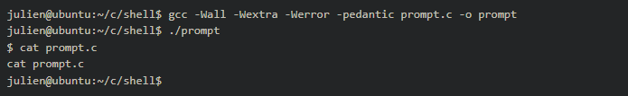

# <ins>simple shell</ins>

## <ins>*Resources*
### <ins>*_Read or watch:_*
* ### [unix shell](https://intranet.alxswe.com/rltoken/f0YU9TAhniMXWlSXtb64Yw)
* ### [Thompson shell](https://intranet.alxswe.com/rltoken/7LJOp2qP7qHUcsOK2-F3qA)
* ### [ken thompson](https://intranet.alxswe.com/rltoken/wTSu31ZP1f7fFTJFgRQC7w)
* ### [Everything you need to know to start coding your own shell concept page](https://intranet.alxswe.com/concepts/64)
## <ins>*_PID & PPID_*
**A process is an instance of an executing program, that has a unique process ID. This process ID is used by many functions and system calls to interact with and manipulate processes. In order to retrieve the current process’ ID, you can use the system call getpid (man 2 getpid):**

* ###  **Note in the example above, that every time you run the program, a new process is created, and its ID is different.**
##### *Each process has a parent: the process that created it. It is possible to get the PID of a parent process by using the getppid system call (man 2 getppid), from within the child process*
### <ins>Exercises
#### <ins>0.getppid
**_Write a program that prints the PID of the parent process. Run your program several times within the same shell. It should be the same. Does echo $$ print the same value? Why?_**
#### <ins>1./proc/sys/kernel/pid_max
**_Write a shell script that prints the maximum value a process ID can be._**
### <ins>Arguments
#### The command line arguments are passed through the main function: int main(int ac, char **av);
* **av is a NULL terminated array of strings**
* **ac is the number of items in av**
#### av[0] usually contains the name used to invoke the current program. av[1] is the first argument of the program, av[2] the second, and so on.
### <ins>Exercises
#### <ins>0.av
**_Write a program that prints all the arguments, without using ac._**
#### <ins>1.Read line
**_Write a program that prints "$ ", wait for the user to enter a command, prints it on the next line. man 3 getline_**
## important
**_make sure you read the man, and the RETURN VALUE section, in order to know when to stop reading Keyword: “end-of-file”, or EOF (or Ctrl+D)._**
* ***Write your own version of getline.***

#### <ins>2.command line to av
**_Write a function that splits a string and returns an array of each word of the string._**
## Executing a program
* **_The system call execve allows a process to execute another program (man 2 execve). Note that this system call does load the new program into the current process’ memory in place of the “previous” program: on success execve does not return to continue the rest of the “previous” program._**

### Warning
**in this example, execve is used without the current environment (last argument), don’t forget to add it in your Shell!**

## Creating processes
* **_The system call fork (man 2 fork) creates a new child process, almost identical to the parent (the process that calls fork). Once fork successfully returns, two processes continue to run the same program, but with different stacks, datas and heaps._**

